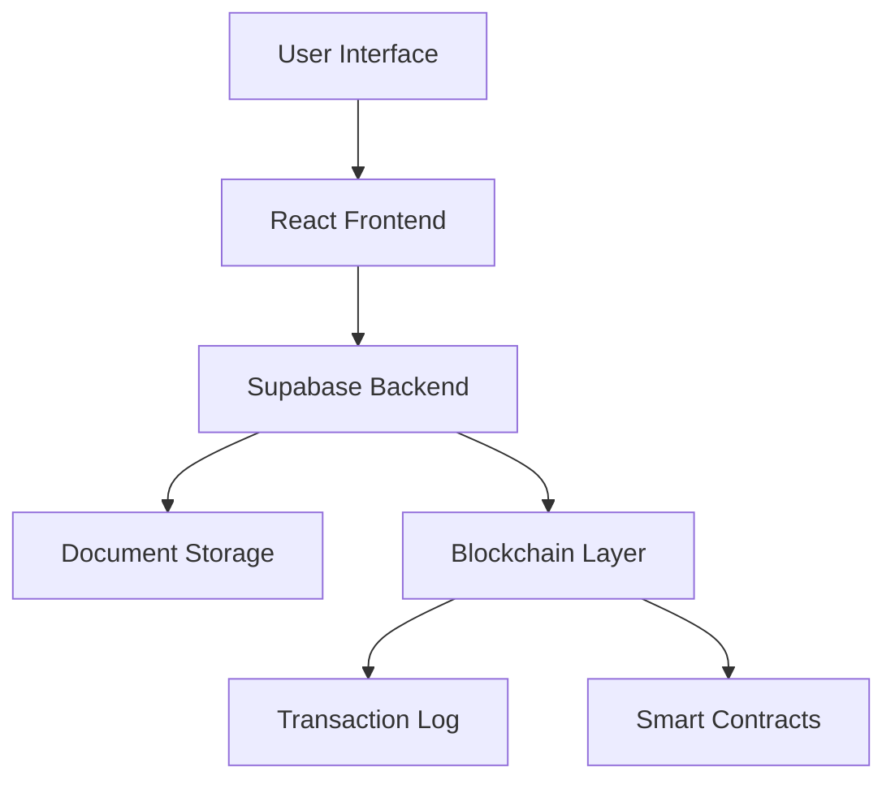
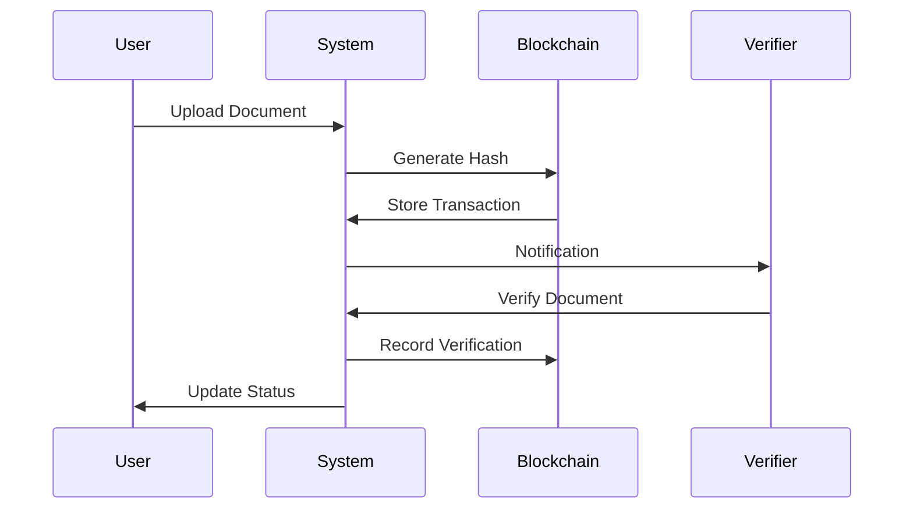

# DocCrypts - Blockchain-Based Document Verification System

<div align="center">
  
  <p>Secure, Transparent, and Decentralized Document Verification</p>
</div>

## 🌟 Overview

DocCrypts is an innovative document verification platform that leverages blockchain technology to ensure the authenticity and integrity of important documents. Built with modern web technologies and a focus on security, it provides institutions and individuals with a reliable way to verify and manage digital documents.

### 🎯 Problem Statement

Traditional document verification processes are:
- Time-consuming and prone to human error
- Vulnerable to forgery and manipulation
- Difficult to track and audit
- Costly due to manual verification requirements

### 💡 Solution

DocCrypts addresses these challenges by:
- Implementing blockchain-based verification
- Providing instant document authenticity checks
- Creating immutable audit trails
- Enabling decentralized trust

## 🏗️ Architecture



### 🔍 Key Components

1. **Frontend Layer**
   - React with TypeScript
   - TailwindCSS for styling
   - Responsive design with glass-morphism UI

2. **Backend Services**
   - Supabase for data management
   - Real-time updates
   - Secure file storage

3. **Blockchain Layer**
   - Custom implementation
   - SHA-256 hashing
   - Immutable transaction logs

## 🚀 Features

### For Users
- Upload documents securely
- Track verification status
- View blockchain records
- Download verified documents

### For Verifiers
- Review pending documents
- Approve/reject with comments
- Access institution-specific documents
- View verification history

### For Administrators
- Manage institutions
- Add/remove verifiers
- Monitor system health
- Access blockchain analytics

  🌐 **Live Demo**: [https://doccrypts.vercel.app/](https://doccrypts.vercel.app/)

---

## 🌟 Key Features

✅ **AI-Powered Upload Verification** – Users can easily upload their documents, which are validated using advanced AI algorithms.

✅ **Admin/Authorized Panel** – Enables organizations and verified personnel to manage users and monitor document workflows.

✅ **Blockchain Wallet Simulation** – Track every document transaction with simulated cryptographic wallets to ensure transparency.

✅ **Document Status Page** – Instantly know whether a document has been verified, pending, or rejected, with visual confirmation.

✅ **Decentralized & Secure** – Leveraging decentralized technologies to eliminate forgery and enhance trust.

---

## 📸 Visual Preview

### 🧾 1. Upload & Verification Page
Allow users to securely upload their identity or form-based documents for AI analysis and further validation.


---

### 🛡️ 2. Admin / Authorized Organization Panel
Admin interface that showcases registered institutions with authority to verify and authenticate documents.


---

### 🔐 3. Blockchain Wallet Transaction Viewer
View the entire lifecycle of document verification stored via simulated blockchain transactions.


---

### ✅ 4. Verified Document Confirmation
The final stamp of trust—users can now see whether their documents are verified with digital authenticity markers.


---


## 🛠️ Technology Stack

- **Frontend**: React 18, TypeScript, TailwindCSS
- **UI Components**: Custom components with Lucide icons
- **Backend**: Supabase
- **Storage**: Supabase Storage
- **Authentication**: Supabase Auth
- **Blockchain**: Custom implementation with SHA-256
- **State Management**: React Context
- **Routing**: React Router v6
- **Date Handling**: date-fns
- **Development**: Vite, ESLint

## 📦 Installation

1. Clone the repository:
```bash
git clone https://github.com/your-username/doccrypts.git
cd doccrypts
```

2. Install dependencies:
```bash
npm install
```

3. Set up environment variables:
```bash
cp .env.example .env
```

4. Update `.env` with your Supabase credentials:
```properties
VITE_SUPABASE_URL=your_supabase_url
VITE_SUPABASE_ANON_KEY=your_supabase_anon_key
```

5. Start the development server:
```bash
npm run dev
```

## 🔄 Workflow



## 🔐 Security

- Document hashing using SHA-256
- Secure file storage with encryption
- Role-based access control
- Real-time blockchain verification
- Audit trails for all actions

## 🧪 Testing

Run the test suite:
```bash
npm run test
```

Key test areas:
- Document upload/verification flows
- Blockchain transaction integrity
- User role management
- API integration tests

## 📈 Performance

- Optimized file handling
- Lazy loading components
- Efficient blockchain queries
- Responsive design patterns

## 🤝 Contributing

1. Fork the repository
2. Create a feature branch
3. Commit your changes
4. Push to the branch
5. Create a Pull Request

## 📄 License

This project is licensed under the MIT License - see the [LICENSE](LICENSE) file for details.

## 👥 Team

Meet the passionate developers behind DocCrypts:
- John Doe - Frontend Lead
- Jane Smith - Blockchain Specialist
- Mike Johnson - Security Expert
- Sarah Wilson - UI/UX Designer

## 🌟 Acknowledgments

- Supabase team for the amazing backend service
- React community for continuous support
- Our beta testers for valuable feedback

## 📞 Contact

For support or inquiries:
- Email: support@doccrypts.com
- Twitter: [@DocCrypts](https://twitter.com/doccrypts)
- Discord: [Join our community](https://discord.gg/doccrypts)
